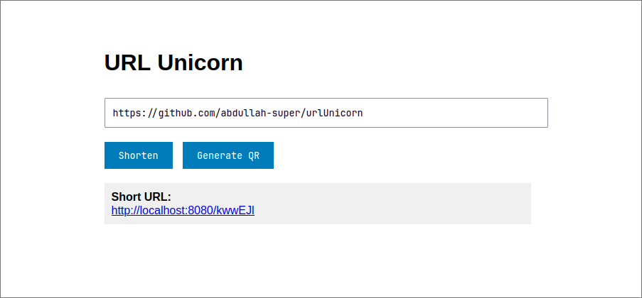
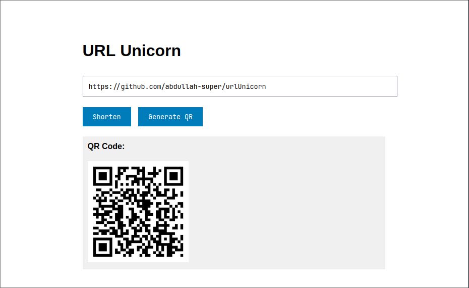

# URL Unicorn 🦄

A modern URL shortener and QR code generator built with Go, Redis, and Chi router. URL Unicorn provides a simple and efficient way to shorten URLs and generate QR codes for easy sharing.




## Features

- 🔗 URL Shortening
- 📱 QR Code Generation
- 📊 Click Statistics
- ⚡ Fast Redis-based Storage
- 🎯 Clean and Simple UI

## Tech Stack

- **Backend**: Go 1.24+
- **Router**: Chi v5
- **Database**: Redis
- **Frontend**: HTML, CSS, JavaScript
- **QR Code**: go-qrcode

## Prerequisites

Before you begin, ensure you have the following installed:

- Go 1.24 or higher
- Redis Server
- Git

## Installation

1. Clone the repository:

```bash
git clone https://github.com/yourusername/url-unicorn.git
cd url-unicorn
```

2. Install dependencies:

```bash
go mod download
```

3. Make sure Redis is running:

```bash
redis-cli ping
```

Should return `PONG`

## Configuration

The application uses the following environment variables:

- `BASE_URL` (optional): Base URL for the shortened links. If not set, it uses the request host.

## Running the Application

1. Start the server:

```bash
go run main.go
```

2. Visit `http://localhost:8080` in your browser

## API Endpoints

### Shorten URL

```http
POST /api/shorten
Content-Type: application/json

{
    "url": "https://example.com"
}
```

### Generate QR Code

```http
POST /api/qr
Content-Type: application/json

{
    "url": "https://example.com"
}
```

### Get URL Statistics

```http
GET /api/stats/{shortCode}
```

## Project Structure

```
├── main.go           # Main application file
├── go.mod           # Go module definition
├── static/          # Static files
│   ├── qrcodes/    # Generated QR codes
│   └── images/     # Documentation images
└── templates/       # HTML templates
    └── index.html  # Main interface
```

## Contributing

1. Fork the repository
2. Create your feature branch (`git checkout -b feature/amazing-feature`)
3. Commit your changes (`git commit -m 'Add some amazing feature'`)
4. Push to the branch (`git push origin feature/amazing-feature`)
5. Open a Pull Request

## License

This project is licensed under the MIT License - see the [LICENSE](LICENSE) file for details.

## Acknowledgments

- [Chi Router](https://github.com/go-chi/chi)
- [go-redis](https://github.com/redis/go-redis)
- [go-qrcode](https://github.com/yeqown/go-qrcode)
